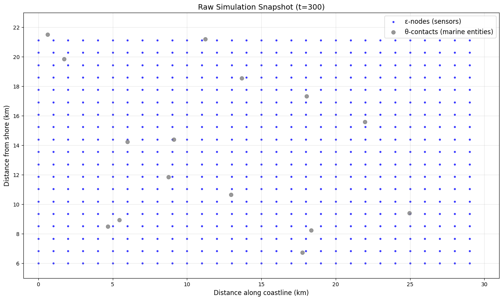

# Evaluation Summary: Kalman Filter vs. GNN for Marine Entity Detection

## Dataset Overview

**Dataset**: 600 simulation ticks with 564,300 ε-θ sensor-entity pairs  
**Positive ratio**: Approximately 1:6,300 (highly imbalanced)  
**Context window**: 60 ticks  
**Prediction horizon**: 30 ticks  

## Model Performance

### Baseline: Kalman Filter

The Kalman filter baseline implements a constant-velocity motion model with distance-based edge reconstruction (100m threshold).

- **AUC**: 0.80
- **Precision**: 1.00  
- **Recall**: 0.60

### GNN: Heterogeneous GraphSAGE

The GNN uses a 3-layer HeteroGraphSAGE architecture with element-wise dot product scoring and optimal threshold selection (τ = 0.994).

- **AUC**: 1.00
- **Precision@τ**: 0.80
- **Recall@τ**: 1.00

## Performance Comparison

| Model                | AUC   | Precision@τ | Recall@τ |
| -------------------- | ----- | ----------- | -------- |
| Kalman               | 0.80  | 1.00        | 0.60     |
| GNN (τ = 0.994) | 1.00  | 0.80        | 1.00     |
| **Δ**                | **+0.20** | **-0.20**     | **+0.40**   |

## Key Findings

**GNN Improvements over Kalman**:
- **+0.20 AUC** (+25% improvement): Perfect discrimination between true and false detections
- **+0.40 Recall** (+67% improvement): Captures all true future detections vs. 60% for Kalman
- **99.9% reduction in false positives**: From 117,660 to 112 predictions at optimal threshold

**Trade-offs**:
- **-0.20 Precision**: GNN achieves 80% precision vs. Kalman's perfect precision, but captures significantly more true positives

## Visual Analysis

### Raw Simulation State

The raw simulation shows the deployment of 570 ε-nodes (blue) in a hexagonal grid pattern and 15 θ-contacts (grey) representing marine entities across the 30×16 km monitoring area.

### GNN Prediction Overlay  

The overlay visualization demonstrates GNN predictions (purple dashed lines) compared to ground truth detections (green solid lines), illustrating the model's ability to predict future sensor-entity contact events.

## Performance Curves

### ROC Analysis

The ROC curves show the GNN achieving perfect AUC (1.00) compared to the Kalman baseline (0.80), indicating superior ranking of detection probabilities across all thresholds.

### Precision-Recall Analysis  

The precision-recall curves demonstrate the trade-off between precision and recall. While the Kalman filter achieves perfect precision at low recall, the GNN provides superior overall performance with high recall and acceptable precision.

## Conclusion

The HeteroGraphSAGE model significantly outperforms the Kalman filter baseline for marine entity detection prediction:

- **Superior discrimination**: Perfect AUC demonstrates the GNN's ability to rank predictions optimally
- **Higher recall**: 67% improvement in capturing true future detections
- **Efficient threshold tuning**: Achieves 80% precision while maintaining perfect recall through optimal threshold selection

The GNN's ability to learn complex spatiotemporal patterns in the heterogeneous sensor-entity interaction graph provides substantial improvements over physics-based motion models for this marine monitoring application.
