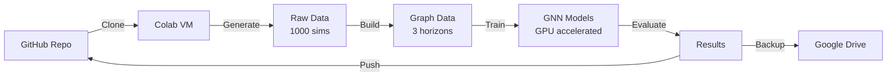

# 🚀 Aquascan → Colab Migration Guide

## Quick Start (3 minutes)

### 1️⃣ Get GitHub Token
```
https://github.com/settings/tokens/new
✓ Select 'repo' scope
✓ Copy the token
```

### 2️⃣ Open Colab
```
https://colab.research.google.com
→ New notebook
→ Runtime → Change runtime → GPU (T4 or better)
```

### 3️⃣ Copy Pipeline Code
Open `notebooks/COLAB_PIPELINE.md` and copy each cell into Colab

### 4️⃣ Run!
- First cell asks for GitHub token
- Rest is fully automated
- Takes ~4-5 hours total

## What Happens



## File Structure After Run

```
your-repo/
├── results/
│   ├── gnn_30tick_results.json     ✅ Pushed to GitHub
│   ├── gnn_100tick_results.json    ✅ Pushed to GitHub
│   ├── gnn_150tick_results.json    ✅ Pushed to GitHub
│   ├── kalman_*_results.json       ✅ Pushed to GitHub
│   └── horizon_comparison.png      ✅ Pushed to GitHub
├── checkpoints/
│   └── gnn_*.pt                    ⚠️  Might be too large for git
└── data/
    ├── raw_5tick/                  💾 On Colab (not pushed)
    └── processed_*/                💾 On Colab (not pushed)

Google Drive/
└── aquascan_backups/
    ├── aquascan_results_*.tar.gz   ✅ All results & models
    └── aquascan_graphs_*.tar.gz    ✅ All processed data
```

## Monitoring Progress

Each major step shows progress bars:
- **Data Generation**: Files created per second
- **Graph Building**: Files processed with ETA
- **Training**: Epochs with loss curves
- **Evaluation**: Immediate results display

## If Colab Disconnects

No problem! The pipeline is designed to be re-entrant:

1. Re-run setup cells (1-2)
2. Check what exists:
   ```python
   !ls data/raw_5tick | wc -l  # Should show your files
   !ls data/processed_*        # Check which horizons done
   ```
3. Skip completed steps and continue

## Pro Tips

- **Keep browser tab active** - Prevents disconnection
- **Use Colab Pro** - Better GPUs, longer runtimes
- **Check GPU**: First cells show which GPU you got
- **Download models**: After training, download checkpoints locally

## Emergency Commands

```python
# Check what's running
!ps aux | grep python

# Monitor GPU
!nvidia-smi -l 1

# Free memory if needed
import gc
torch.cuda.empty_cache()
gc.collect()

# Check disk space
!df -h /content
```

Ready to let Colab do the heavy lifting? 🚀
